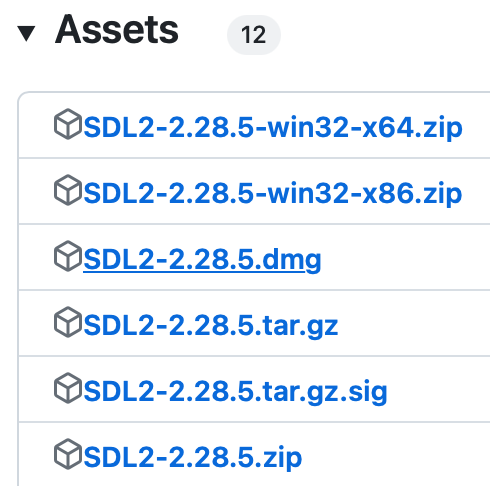

# Building Software

- [ ] Instructions on how to build your software should be written in this file
	- This is especially important if you have added additional dependencies.
	- Assume someone who has not taken this class (i.e. you on the first day) would have read, build, and run your software from scratch.
- You should have at a minimum in your project
	- [ ] A dub.json in a root directory
    	- [ ] This should generate a 'release' version of your software
  - [ ] Run your code with the latest version of d-scanner before commiting your code (could be a github action)
  - [ ] (Optional) Run your code with the latest version of clang-tidy  (could be a github action)

*Modify this file to include instructions on how to build and run your software. Specify which platform you are running on. Running your software involves launching a server and connecting at least 2 clients to the server.*

*NOTE:* Part of the following build instruction is modified from https://github.com/Fall23FSE/monorepo-lilychan16/blob/main/Assignment5_SDL_Setup/warmup/README.md and https://piazza.com/class/llrgb3rgyye443/post/41_f1.

## Platform

This project has been successfully run on MacOS system.

## STEP 1 - Installing the DMD Compiler

First, we need a compiler that can understand D code.

- Search on the web for "DMD compiler download" or directly visit: https://dlang.org/download.html. Download the DMD installer based on your operating system.
	- For Mac M1/M2, the installer should be a **.dmg** file.
- Or, you can use homebrew to install DMD: `brew install dmd`

## (YOU MAY NEED THIS) STEP 1 - Installing the LDC Compiler

Sometimes the DMD compiler may not work for Mac M1/M2. In that case, you need to download the LDC Compiler instead. 

**1. Uninstall DMD:**

- If you used homebrew to install DMD: `brew uninstall dmd` (https://formulae.brew.sh/formula/dmd)
- If you downloaded from dlang webpage:
	- Download the dmg file again.
	- If you open dmg file, you'll see `uninstall.command` . Run it (You might need to enable security permission to run it)
- Check that dmd is uninstalled by checking if dmd runs in terminal (command should not be found).

**2. Install LDC:**

- Use homebrew to install LDC2: `brew install ldc` (https://formulae.brew.sh/formula/ldc)
- Or, you can watch this video on how to install ldc: https://www.youtube.com/watch?v=FFcYVlZ7u7k
- Check LDC is installed: `ldc2 --version`
- On MacOS, go to /Users/**replace with your username**/dlang/ to check if there's a ldc folder there
	- As of 12/07/2023, the folder name is the latest release: ldc-1.34.0
	- Inside that ldc folder, go to the **bin** folder and make sure a **dub** executable exists
	- 

## STEP 2 - Installing Dub

Dub is the official package management tool for the D programming language.

- The **releases** for Dub are hosted here: https://github.com/dlang/dub/releases
	- You can scroll down and click 'Assets' and you should find an archive file for your operating system

	- 
- Dub installed through operating system package managers
	- Mac:
		- If Mac users were unable to install through the 'releases' on github, then you can try:
		- Installing https://brew.sh/ - a package manager for Mac that you use on the terminal.
		- Then try `brew install dub` on the command line (and wait a few seconds or minutes to install)
		- Note: Some Mac users may get errors and need to run: `export MACOSX_DEPLOYMENT_TARGET=11` before running dub.
	- Linux:
		- For folks who installed dmd, you should already have dub.
		- Otherwise, you can try `sudo apt-get install dub` 
	- Window: 
		- It is also likely that if you setup dmd, you should be able to use dub from the terminal as well.
		- Windows folks should be able to install from the zip file and the releases if they otherwise do not have dub available.

## STEP 3 - Installing Dependencies

This project requires several dependencies. Please make sure you've implemented the following dependencies before running the project.

### 1. SDL2 Libraries

- Mac:
	- Go to https://www.libsdl.org and click the "SDL Releases" link in the download section (bottom left corner)
	- 

	- Find the latest version for MacOS. It should be a **.dmg** file.

	- 
	
	- Once you download it, copy the **SDL2.framework** folder to **/Library/Frameworks**. (Hint: You can use Finder -> Go -> Go to Folder... to easily find the Frameworks folder.)
	- *Optional*: Or you can follow the first 2 minutes and 13 seconds of this video: https://www.youtube.com/watch?v=V6ACATpl2LQ&list=PLvv0ScY6vfd-p1gSnbQhY7vMe2rng0IL0&index=5 for the same instruction.
- Linux:
	- Type in : `sudo apt-get install libsdl2-dev`  
	- Review this video if you have difficulty: https://www.youtube.com/watch?v=P3_xhDIP7bc&list=PLvv0ScY6vfd-p1gSnbQhY7vMe2rng0IL0&index=3
- Windows: 
	- Follow this tutorial for setting up SDL: https://youtu.be/DQ-NBjBFLJ4?t=454
	- Note: If you have mingw setup, this is all you need to do.

### 2. SDL Mixer

Our project uses SDL Mixer for audio playback. Go to https://github.com/libsdl-org/SDL_mixer/releases to download the latest version.

- Mac:
	- For MacOS, it should be a **.dmg** file.
		- As of 12/05/2023, the latest release is version 2.6.3.
	- Once you download it, copy the **SDL2_mixer.framework** folder to **/Library/Frameworks**. (Hint: You can use Finder -> Go -> Go to Folder... to easily find the Frameworks folder.)

- Windows:
	- Use the latest release link above to download one of the win32 zip files based on your procecessor.

### 3. GtkD

DLang provides bindings to the GtkD Graphical User Interface and this project uses it to present the chat windows.

- First, run `brew install gtk+3`
- Then run `brew info atk` and `brew info gtk+3` to get the installation path of libraries installed with gtk+3
- After you run `brew info atk`, copy the installation path
	- 
- Now, we need to set environment variables:
	- Run `export DFLAGS="-L-L/opt/homebrew/Cellar/**your atk version**/lib -L-latk-1.0.0"`
		- For example, `export DFLAGS="-L-L/opt/homebrew/Cellar/at-spi2-core/2.50.0/lib -L-latk-1.0.0"` (This is just an example, make sure you copy your own path)
		- Run `echo $DFLAGS` to check the path
	- Then, run `export DYLD_FALLBACK_LIBRARY_PATH=/opt/homebrew/lib`
		- Run `echo $DYLD_FALLBACK_LIBRARY_PATH` to check the path
	- You may also need to run `export MACOSX_DEPLOYMENT_TARGET=13` if you run into issues
		- Try other values if this does not work (e.g. 11)
- Now, we need to set the environment variables globally for GtkD, so that we can smoothly run multiple clients:
	- Run `nano ~/.zshrc` to access your .zshrc file
		- You may use another text editor, such as vim
		- If your system is running on bash, run `nano ~/.bash-profile` to access your .bash-profile file instead
	- Once you open that file, **scroll down to the end**
	- Add all the environment variables in the previous step (e.g.: `export DYLD_FALLBACK_LIBRARY_PATH=/opt/homebrew/lib`) to the file and save it
	- Execute the new file by running `source ~/.zshrc`
		- Or if your system is on bash, run `source ~/.bash-profile`
	- **Make sure you run `source ~/.zshrc` (or bash) every time before running a GtkD command!**

### 4. Unit Threaded

unit-threaded is one of the most popular frameworks in the D programming langauge. It has many capabilities for writing and creating tests.

Our project uses **version 2.1.7** to run our tests. Go to https://code.dlang.org/packages/unit-threaded to download this version or otherwise tthe latest version available. 
- The idea is to run `dub add unit-threaded` in the project's **root directory**.

## STEP 4 - Running the Project

- First, inside **FinalProject/server** folder, run `dub` to create a new server
	- If a window pops up asking you to allow incoming network connections, click "Allow"
		- 

	- Copy the ip address that the server is running on
		- 

- Then, inside **FinalProject/client** folder, run `dub` to create a new client
	- For MacOS, if `dub` doesn't work, you need to use ldc2:
		- First, run `source ~/.zshrc` (or `source ~/.bash-profile`)
		- Then, run dub directly from your ldc bin folder: `/Users/**your username**/dlang/**your ldc folder name**/bin/dub`
			- For example, `/Users/lilychen/dlang/ldc-1.34.0/bin/dub` (This is just an exmaple, you need to modify it using your own username and ldc folder name)
	- You can create multiple clients by running the above commands in a new terminal
- Once you create a new client, first, enter your desired username for the game
- Then, enter the ip address that the server is running on (You copied in step 1)

### When game is running
- Once you enter the game, you can send a message in the chat window, and walk around in the game window
	- If other users enter the game or exit the game, you'll be notified in your chat window
- You can listen to different music in different rooms. When you are inside a room, **go to the turn table in that room** to get a playlist printed in your client terminal.
- Select a music using number 1 to 4 from your keyboard. Once you press a valid key, the music in that room will be switched to the one you just selected.
	- At this time, other players in the same room will also listen to the same music you just selected, not the one they listened to when they first entered the room.
	- Other players can also select their favorite music, in that case, if you are still in that room, you will be listening to the new music they just selected.
	- This feature fulfills the "sharing" theme requirement.
- Every player in the same room can **go to the turn table** and then press P on the keyboard to pause or resume the current song.
- Once you are done with exploring the game, exit the game by clicking the "x" button on screen, or typing ctrl + c in your client terminal.

## Troubleshooting tips
- Sometimes the server says that the ip address is taken after starting a server, closing, and then trying to start another server. run `lsof -i:50001 && lsof -i:50002` to clear, then you can run dub again

## Running unit tests
Use the command `dub -b unittests` in either the `/FinalProject/client` or `/FinalProject/server` directory

